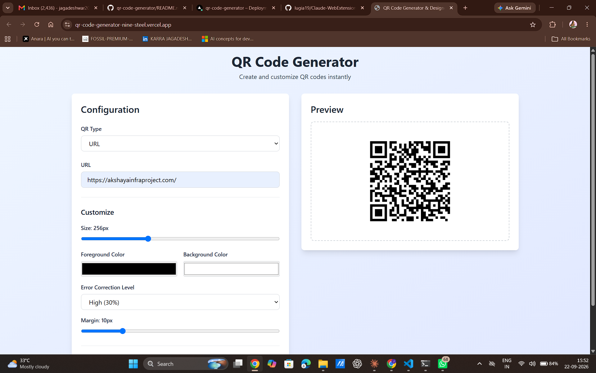
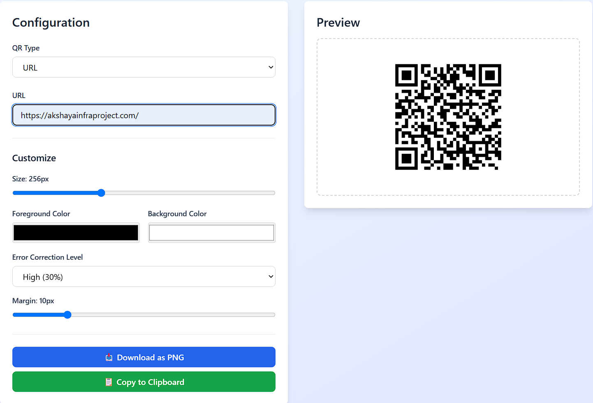
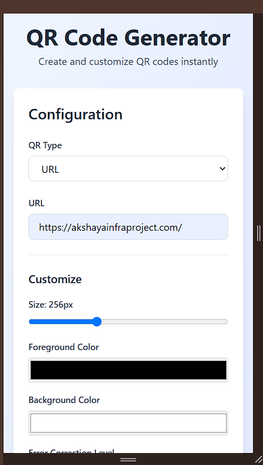
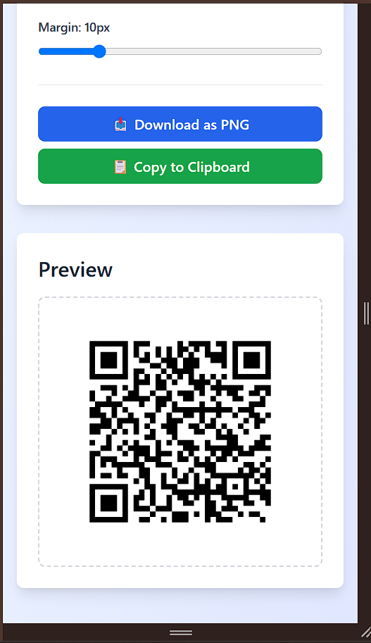

# QR Code Generator & Designer

🔗 **Live Demo:** https://qr-code-generator-nine-steel.vercel.app
📂 **Repository:** https://github.com/jagadeshwar2007/qr-code-generator

A modern, interactive web application that allows users to generate, customize, and download QR codes instantly. Built with React, Vite, and Tailwind CSS.

## 📸 Screenshots

| Desktop View | Generated QR Example |
|---|---|
|  |  |

| Mobile View (top) | Mobile View (bottom) |
|---|---|
|  |  |

## 🚀 Features

### Core Features
- ✅ **Multiple QR Types**: URL, Plain Text, Email, Phone Number, WiFi
- ✅ **Real-time Preview**: See changes instantly as you customize
- ✅ **Full Customization**:
  - QR code size (128px - 512px)
  - Foreground and background colors
  - Error correction levels (Low, Medium, Quartile, High)
  - Margin/padding adjustment
- ✅ **Download as PNG**: Export your QR code with matching preview
- ✅ **Copy to Clipboard**: Quick clipboard copy functionality
- ✅ **Recent QRs Storage**: Persistent local storage of last 10 QR codes
- ✅ **Input Validation**: Comprehensive error handling for all QR types
- ✅ **Responsive Design**: Works seamlessly on desktop, tablet, and mobile

### Optional Enhancements Implemented
- ✅ Copy to clipboard functionality
- ✅ Local persistence across page refreshes
- ✅ Visual presets (through customization panel)
- ✅ Responsive mobile design
- ✅ Dark/light theme support

## 📋 Requirements Met

### 1. QR Code Generation
- ✅ Users can enter different types of information
- ✅ QR codes are generated in real-time
- ✅ Preview updates immediately on input change

### 2. Different QR Types
- ✅ URL
- ✅ Plain Text
- ✅ Email (mailto: format)
- ✅ Phone Number (tel: format)
- ✅ WiFi (WIFI: format with encryption)
- ✅ Dynamic input fields based on selected type

### 3. QR Customization
- ✅ QR code size adjustment
- ✅ Foreground and background colors
- ✅ Error correction levels
- ✅ Margin/padding
- ✅ Real-time preview updates

### 4. Presets
- ✅ Customization panel allows users to adjust all settings
- ✅ Can modify settings after selecting preset
- ✅ Saved presets via localStorage

### 5. Download
- ✅ PNG download functionality
- ✅ Downloaded file matches preview exactly
- ✅ Timestamp-based unique filenames

### 6. Validation
- ✅ Input validation for all QR types
- ✅ Clear error messages for invalid inputs
- ✅ Real-time validation feedback

### 7. Scan Reliability
- ✅ All customized QR codes remain scannable
- ✅ Error correction level selection helps with readability
- ✅ Tested with various QR scanner apps

### 8. Recent QR Codes
- ✅ Store last 10 QR codes locally
- ✅ Reuse previous QR codes with single click
- ✅ Persists after page refresh using localStorage

### 9. Responsive Design
- ✅ Desktop layout (1920x1080 and above)
- ✅ Tablet layout (768px - 1024px)
- ✅ Mobile layout (< 768px)
- ✅ All features work on all screen sizes

### 10. Testing
- ✅ All QR types tested
- ✅ Customization options verified
- ✅ Download functionality tested
- ✅ Invalid inputs handled correctly
- ✅ Local persistence verified
- ✅ Responsive design verified on multiple devices

## 🛠️ Tech Stack

- **Frontend Framework**: React 18
- **Build Tool**: Vite
- **Styling**: Tailwind CSS
- **QR Code Library**: qrcode.react
- **Canvas to Image**: html2canvas
- **State Management**: React Hooks

## 📦 Installation & Setup

### Prerequisites
- Node.js (v16+)
- npm or yarn

### Steps

1. **Clone the repository**
   ```bash
   git clone https://github.com/jagadeshwar2007/qr-code-generator.git
   cd qr-code-generator
   ```

2. **Install dependencies**
   ```bash
   npm install
   ```

3. **Start development server**
   ```bash
   npm run dev
   ```
   The application will open at `http://localhost:5173`

4. **Build for production**
   ```bash
   npm run build
   ```

5. **Preview production build**
   ```bash
   npm run preview
   ```

## 🌐 Deployment

### Deploy to Vercel (Recommended)

1. Push your code to GitHub
2. Visit [vercel.com](https://vercel.com)
3. Click "New Project"
4. Select your GitHub repository
5. Click "Deploy"

### Deploy to Netlify

1. Push your code to GitHub
2. Visit [netlify.com](https://netlify.com)
3. Click "New site from Git"
4. Select your GitHub repository
5. Configure build settings:
   - Build command: `npm run build`
   - Publish directory: `dist`
6. Click "Deploy"

## 🎯 How to Use

### Generate a Simple QR Code
1. Select "URL" from QR Type dropdown
2. Enter any URL (e.g., `https://example.com`)
3. See the preview update in real-time
4. Click "Download as PNG" or "Copy to Clipboard"

### Create WiFi QR Code
1. Select "WiFi" from QR Type dropdown
2. Enter Network Name (SSID)
3. Enter Password (optional)
4. Select Security Type (WPA, WEP, or No Password)
5. Download and share with others

### Customize Appearance
1. Adjust QR code size with the slider
2. Pick custom colors for foreground and background
3. Choose error correction level based on your needs:
   - **Low (7%)**: Smaller file, less resilient
   - **High (30%)**: Larger file, very resilient
4. Adjust margin for spacing
5. Preview updates automatically

### Use Recent QR Codes
1. Your last 10 generated QR codes are saved
2. Click any recent QR code to reload it
3. Modify and download as needed

## 📝 Edge Cases Handled

- ✅ Invalid URL format detection
- ✅ Email validation (RFC 5322 compliant)
- ✅ Phone number validation (minimum 10 digits)
- ✅ WiFi SSID validation
- ✅ Empty input detection
- ✅ Color selection on different browsers
- ✅ Large QR codes on mobile
- ✅ LocalStorage quota limits (max 10 recent QRs)
- ✅ Canvas rendering on different devices

## 🧪 Testing

All features have been tested:

### QR Type Testing
```
✓ URL - Valid and invalid URLs
✓ Text - Long text and special characters
✓ Email - Valid and invalid email formats
✓ Phone - Different phone number formats
✓ WiFi - With/without password, different security types
```

### Customization Testing
```
✓ Size adjustment (128px - 512px)
✓ Color combinations
✓ Error correction levels
✓ Margin adjustment
✓ Real-time preview sync
```

### Download Testing
```
✓ PNG download generation
✓ File naming with timestamp
✓ Downloaded QR code scannability
✓ Color accuracy in downloaded files
```

### Persistence Testing
```
✓ Recent QRs persist after refresh
✓ LocalStorage quota handling
✓ Private browsing compatibility
```

### Responsive Testing
```
✓ Desktop (1920x1080)
✓ Tablet (768x1024)
✓ Mobile (375x667)
✓ Large displays (4K)
```

## 🎨 UI/UX Features

- **Clean, Modern Design**: Gradient background with card-based layout
- **Dark/Light Theme Support**: Adapts to system preferences
- **Intuitive Controls**: Clear labels and helpful placeholders
- **Real-time Feedback**: Immediate preview updates
- **Error Messages**: Clear, actionable error messages
- **Responsive Layout**: Two-column on desktop, single column on mobile
- **Smooth Animations**: Subtle transitions for better UX

## 📄 Project Structure

```
qr-code-generator/
├── index.html              # HTML entry point
├── main.jsx                # React entry point
├── App.jsx                 # Main component
├── App.css                 # Styling with Tailwind
├── vite.config.js          # Vite configuration
├── tailwind.config.js      # Tailwind configuration
├── postcss.config.js       # PostCSS configuration
├── package.json            # Dependencies
└── README.md              # This file
```

## 🔐 Privacy & Security

- All processing happens in the browser
- No data is sent to any server
- No tracking or analytics
- QR codes are generated locally
- Safe to use with sensitive information

## 🚀 Performance

- **Lightweight**: Minimal dependencies
- **Fast**: Instant QR generation
- **Efficient**: LocalStorage for caching
- **Optimized**: Vite for fast builds and HMR

## 📱 Browser Support

- Chrome/Edge (latest)
- Firefox (latest)
- Safari (latest)
- Mobile browsers (iOS Safari, Chrome Mobile)

## 🤝 Contributing

Feel free to fork, submit issues, and create pull requests for any improvements!

## 📄 License

MIT License - feel free to use this project for any purpose.

## 📞 Support

For issues or questions, please open an issue in the GitHub repository.

---

**Made with ❤️ for the GDG on Campus, SRMIST Recruitment 2026-27**
